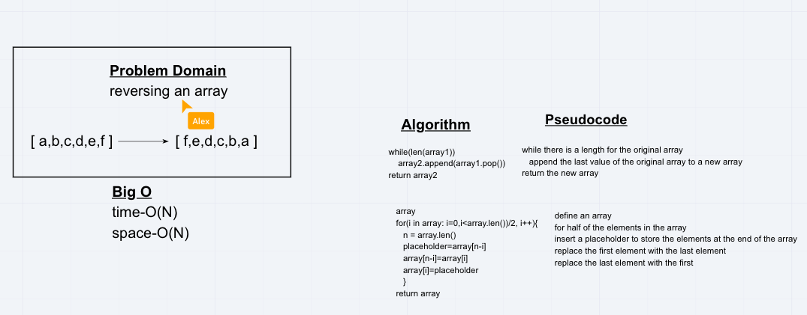

# Challenge 01 - Reverse an Array

Write a function called reverseArray which takes an array as an argument. Without utilizing any of the built-in methods available to your language, return an array with elements in reversed order.

## Approach and Efficiency

### method 1

* O(2n) space
* O(n) time
* immutable
* steps:
  1. create a new empty array.
  1. In a while loop, while the original array has length
     * pop the last value off the original array
     * append that value to the new array
  1. return the new array after the while loop is terminated

### method 2

* O(n) space
* 0(n) time
* mutable
* steps:
  1. iterate halfway through an array
     * for each element in the array, swap it with the len-idx element
  2. return the array

## Whiteboard solution

[<-- Python Challenges](../README.md)
