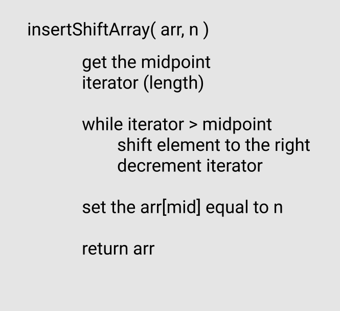

# Challenge 02 - Shift an Array

Write a function called insertShiftArray which takes in an array and the value to be added. Without utilizing any of the built-in methods available to your language, return an array with the new value added at the middle index.

## Approach and Efficiency

### method 1

* O(n) space
* O(n) time
* mutable
* steps:
  1. iterate from the end of an array towards the middle
     * for each element, set the value to the right as this elements value
  2. after the middle is reached set the midpoint value as the new value
  3. return the array

## Whiteboard solution

[<-- Python Challenges](../README.md)
