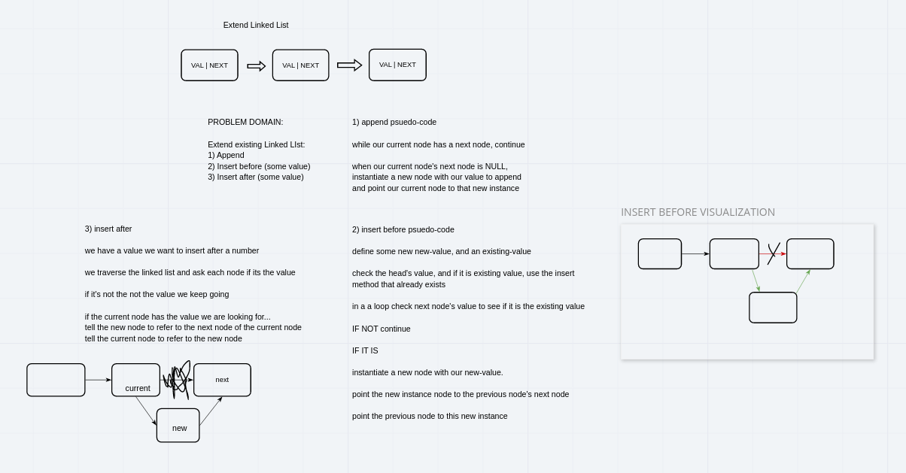
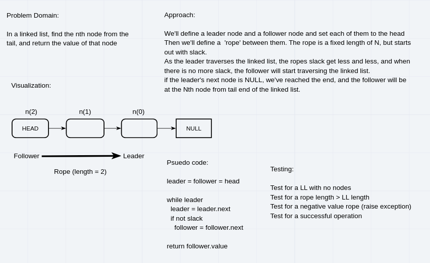
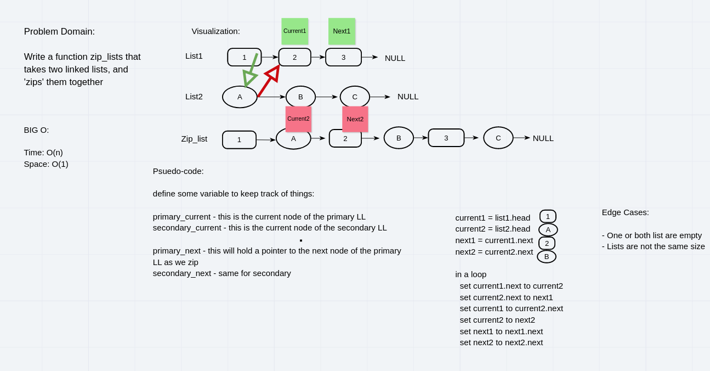

# Linked List

## Pull requests

* [Challenge 05 | linked list](https://github.com/skrambelled/data-structures-and-algorithms/pull/21)
* [Challenge 06 | append, insert_before, insert_after](https://github.com/skrambelled/data-structures-and-algorithms/pull/22)
* [Challenge 07 | kth_from_end](https://github.com/skrambelled/data-structures-and-algorithms/pull/25)
* [Challenge 08 | zip](https://github.com/skrambelled/data-structures-and-algorithms/pull/26)

## Problem domain:

Implement a Linked List

* It should be able to insert a node at the head using O(1) time and space
* It should be able to determine if a value is stored in the list
* It should be able to represent all the data being stored in the node of the list

* append a node to the end of the LL
* insert a node before a given value
* insert a node after a given value

## Whiteboards

### insert

### kth_from_end

### zip

## Implementation

`LinkedList`

* `__str__` - will use a fstring to print out each ndoe
* `insert(value)` - will create a new node, insert it at the beginning of the list and set the value
* `includes(value)` - will traverse the list forwards and return a boolean `True` when the value is encountered, or `False` if never found
* `append(value)` - append a new node with `value` at the end of the list,
* `insert_before(new_value, reference_value)` - insert a `new_value` into the linked list before the first occurrence of `reference_value`, otherwise raise an exception
* `insert_after(new_value, reference_value)` - insert a `new_value` into the linked list after the first occurrence of `reference_value`, otherwise raise an exception
* `kth_from_end(k)` - return the value that is at the node with a distance of k from the tail
* `zip` - merge another list into this list, like a zipper on a coat

DoubleLinkedList

* inherits `LinkedList`

## Future implementations:

* method to remove a node
* method to merge two sorted lists

[<-- Python Challenges](../README.md)
